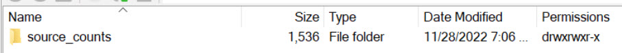
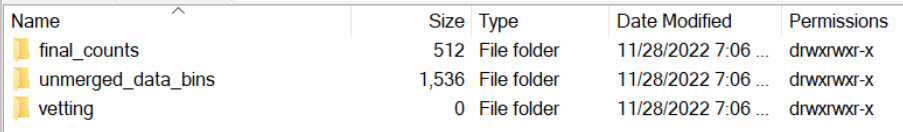
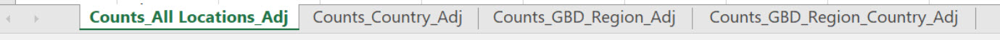
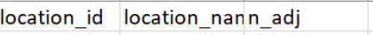

Contact: Christian Hernandez (chrish47@uw.edu)

## **Using the Source Counts Function**

**(1)** Make sure you are on the cluster for this, and that have you have an R interactive session opened. Please see the HUB for more details.  
**(2)** Script: "/ihme/scratch/projects/rgud/Source Counts Tool 2022/Code/Source Counts Code/source_counts_master.R"  
* Run this on your console: `source("/ihme/scratch/projects/rgud/Source Counts Tool 2022/Code/Source Counts Code/source_counts_master.R")`  

> You don't have to run anything else. Simply source in the above script.  

* Source counts function: `source_counts()`  
* You can enter a `crosswalk_version_id, bundle_version_id, or a custom data table`.  
* Please make sure your custom data table input contains the following columns: `nid, location_id, location_name, year_start, and year_end`.  
**(3)** Source in your location_data. REQUIRED.   
* Function: `get_location_metadata()`  
* Most common *location_set_id: 35*  
* Please use the *location_data* object name.  
  
    `location_data <- ...`  
**(4)** When using the source_counts(), please make sure your out_path filepath exists.  
**(6)** For example calls and explanations, please see the section below Title 'Example Calls'.    

**If you run into the following error:**  
`Error in .local(drv, ...) : Cannot allocate a new connection: 16 connections already opened`  

> Run the following line on your console: `disconnection <- lapply(dbListConnections( dbDriver( drv = "MySQL")), dbDisconnect)`  

## **Source Counts Strategy - Mechanics**

**We Can Only Count 'Sources' That Meet The Following Criteria**

* It is a GBD project with data that comes through our sources data ingestion pipeline. We don't count custom data outside our sources database.  
* The source data corresponds to valid NIDs that are published in the GHDx. Our source counts are all based on GHDx Record NIDs.  
* The source counts requested can be fulfilled with the data we have in our sources database / source counts tables. Data we have in-house. 

**General NID strategy Overview**

**(1) NID Relationships**  
    * If a Record NID or replaced underlying NID is a Merged Citation, we break apart the Merged Citation into its associated component NIDs.  
    * If a Record NID has an underlying NID, the Underlying NID is used.[Currently Being Investigated!]    
**(2) NID’s Data Type***  
    * Every GHDx Record NID has a data type (it is required).  
    * In some counting strategies, records are counted differently depending on data type.  
**(3) NID Validity***  
    * NIDs must be valid, published, Record NIDs from the GHDx. We do not count “file” NIDs, “series or system” NIDs, aggregate NIDs, or any fake NIDs.
    
**Source Counting Method**
* Source counts will be generated using the following Counting Strategy Combination  

`NID + location + year_start + year_end`

* The above combination strategy is applied accross all data types.  
* According to the GBD strategy Scientific literature, Financial records, Survey, Census, and Clinical trial should be counted by NID only. `source_counts()` doesn't count these data types by NID only - It counts them by the above combination as with all the other data types. We believe implementing this combination counting method across all data types is more accurate than doing it different accross different data types.  

[For more details on the GBD Source Counts strategy, please click here](https://hub.ihme.washington.edu/display/SCDS/Source+Counts+-+Source+Counting+Strategy)

## **Example Calls**

**With Crosswalk Version ID**  
* Source Counts for the whole crosswalk version ID you enter.  
`source_counts(cw_id = 19694, out_path = "/ihme/scratch/users/chrish47/Source_Counts_Testing_Nov2022/cw_id_19694/")`  
* Source Counts for Clinical Data only, for the crosswalk version ID you enter. ~ This has not has been developed for the custom table option yet.  
`source_counts(cw_id = 19694, clinical_data_only = TRUE, out_path = "/ihme/scratch/users/chrish47/Source_Counts_Testing_Nov2022/cw_id_19694/")`  
* Source Counts for Non-Clinical Data only, for the crosswalk version ID you enter. ~ This has not has been developed for the custom table option yet.  
`source_counts(cw_id = 19694, nonclinical_data_only = TRUE, out_path = "/ihme/scratch/users/chrish47/Source_Counts_Testing_Nov2022/cw_id_19694/")`  
* Source Counts by Source Type or Measure Type ~ Please keep in mind that the source_type argument is column-specific and with the use cw_id(It hasn't yet been tested with custom_data_table). If you want to use this this option, please make sure your crosswalk version ID and/or data inputs have 'source_type' and 'measure_type'.  
* For the measure_type column, only 'incidence' and 'prevalence' has been tested.  
* For source_type column, only 'inpatient' and 'claims' have been tested.   
* If you want Source Counts for specific subsets of your main data input. I would recommend to do the prep work before, that includes the desired data, and use the custom_data_table option instead.
`source_counts(cw_id = 12221, source_type = 'inpatient', out_path = "/ihme/scratch/users/chrish47/Source_Counts_Testing_Nov2022/cw_id_19694/")`
`source_counts(cw_id = 12221, source_type = 'claims', out_path = "/ihme/scratch/users/chrish47/Source_Counts_Testing_Nov2022/cw_id_19694/")`
`source_counts(cw_id = 12221, source_type = 'prevalence', out_path = "/ihme/scratch/users/chrish47/Source_Counts_Testing_Nov2022/cw_id_19694/")`
`source_counts(cw_id = 9890, source_type = 'inpatient', out_path = "/ihme/scratch/users/chrish47/Source_Counts_Testing_Nov2022/cw_id_19694/")`
`source_counts(cw_id = 9890, source_type = 'claims', out_path = "/ihme/scratch/users/chrish47/Source_Counts_Testing_Nov2022/cw_id_19694/")`
`source_counts(cw_id = 9890, source_type = 'prevalence', out_path = "/ihme/scratch/users/chrish47/Source_Counts_Testing_Nov2022/cw_id_19694/")`

**With Custom Data Input**  
* Prepping custom dataset:  
`dt <- read.xlsx("/ihme/scratch/projects/rgud/Source Counts Tool 2022/Testing/testing_dt.xlsx") %>% select(-'location_name.x', -'location_name.y')`  
* Total/All source counts for custom data input.  
`source_counts(custom_data_table = dt, out_path = "/ihme/scratch/users/chrish47/Source_Counts_Testing_Nov2022/custom_table/")`  
* Subset source counts for 'All_data'(column) for custom data input. All rows(data) with a value of 1 under 'All data' will be processed.  
`source_counts(custom_data_table = dt, custom_subset_column_names = 'All_data', custom_subset_column_values = 1, out_path = "/ihme/scratch/users/chrish47/Source_Counts_Testing_Nov2022/custom_table/")`  
* Subset source counts for 'Vital_Reg'(column) for custom data input. All rows(data) with a value of 1 under 'Vital_Reg' will be processed.  
`source_counts(custom_data_table = dt, custom_subset_column_names = 'Vital_Reg', custom_subset_column_values = 1, out_path = "/ihme/scratch/users/chrish47/Source_Counts_Testing_Nov2022/custom_table/")`

>Please view `example_call_script.R` if you are interested in how a script may look like. Feel free to run it as is, but please change the output filepath to yours.

## **Source Count File outputs in your out_path**

**A source_counts folder automatically gets created if it doesn't exist already in your out_path**  

**Inside the source_counts folder, you will have three different subfolders**  

* *final_counts*  
    - This folder contains your final source counts report. These source counts take into account merge nids.   
* *unmerged_data_bins*  
    - This folder contains your unmerged source counts report and other files containing GHDx sourced in data that are used to create your final source counts report.  
* *vetting*  
    - Empty folder ~ Included for conducting any vetting work by the user.    
	

**Both the Final and Unmerged source counts files contain the same tabs and columns.**  

## **Notes** 

**A quick summary on how source counts are formatted by location/country/region**
 
**Counts_All_Locations_Ajd**, contains source counts at the most detailed location_id level. This includes all source counts by location_id/location_name.  
    - Using the below tables: Each table at the location_id/location_name has 5 total source counts.  
**Counts_Country_Adj**, contains source counts at the country level. All non-country locations are assigned to their corresponding Countries for source counts.  
    - Using the below tables: Table 1, at the country level, would have 2 total source counts. Table 2, at the country level, would have 5 total source counts. Pay close attention to the year spread.  
**Counts_GBD_Region**, contains source counts at the GBD regional level. Counntry/subnational  
    - Using the below tables: Table 1, at the regional level, would have 1 total source count. Table 2, at the regional level, would have 5 total source counts. Pay close attention to the year spread.  
**Counts_GBD_Region_Country_Adj**, combines the source counts from the Counts_Country_Adj and Counts_GBD_Region tabs.  

| location_id|location_name |country                 |region_name               | year_start| year_end|
|-----------:|:-------------|:-----------------------|:-------------------------|----------:|--------:|
|         523|Alaska        |United State of America |High-income North America |       2010|     2011|
|         524|Alabama       |United State of America |High-income North America |       2010|     2011|
|         560|Oregon        |United State of America |High-income North America |       2010|     2011|
|         570|Washington    |United State of America |High-income North America |       2010|     2011|
|         101|Canada        |Canada                  |High-income North America |       2010|     2011|

| location_id|location_name |country                 |region_name               | year_start| year_end|
|-----------:|:-------------|:-----------------------|:-------------------------|----------:|--------:|
|         523|Alaska        |United State of America |High-income North America |       2010|     2011|
|         524|Alabama       |United State of America |High-income North America |       2015|     2016|
|         560|Oregon        |United State of America |High-income North America |       2021|     2021|
|         570|Washington    |United State of America |High-income North America |       2020|     2020|
|         101|Canada        |Canada                  |High-income North America |       2023|     2023|
